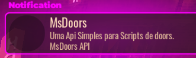
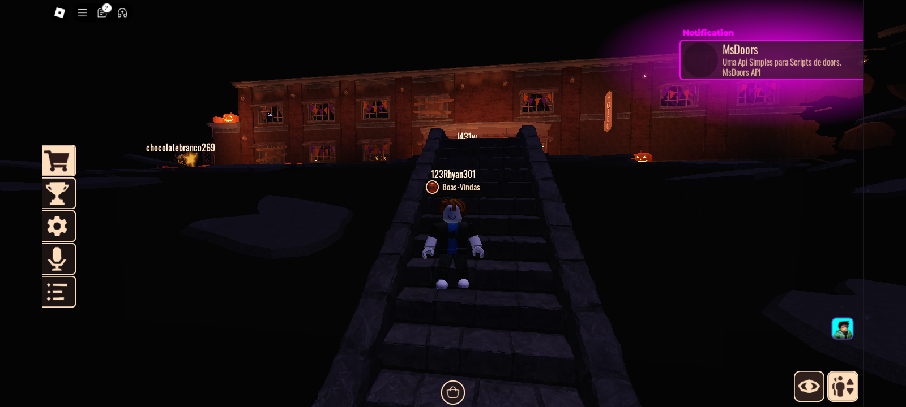

# 🌟 MsdoorsNotify - Notificações ao Estilo "Doors" para Roblox 🌟
> Funciona apenas no **__Doors__** e nos fã games!



`MsdoorsNotify` é uma função poderosa e fácil de usar para criar notificações inspiradas no jogo "Doors" do Roblox. Com ela, você pode exibir alertas visuais e auditivos estilizados com título, descrição, imagem e personalizações de cor e tempo! 🖥️🎨

---

## 📥 Baixando e Instalando (DIRETO NO SCRIPT)
> [Baixe Aqui](https://github.com/Sc-Rhyan57/Notification-doorsAPI/blob/main/Msdoors/Msdoors.lua)

1. **Baixe o Script**: Copie o código da função `MsdoorsNotify` e adicione ao seu script no Roblox Studio.
2. **Verifique os Guias**: As notificações precisam de um GUI principal (`PlayerGui`) contendo `MainUI`. Certifique-se de que a interface gráfica do jogo tem essas configurações para que a função funcione corretamente.

## 📥 Baixando e Instalando (POR API)
```lua
local MsdoorsNotify = loadstring(game:HttpGet("https://raw.githubusercontent.com/Sc-Rhyan57/Notification-doorsAPI/refs/heads/main/Msdoors/MsdoorsApi.lua"))()
```
---

## 🎨 Como Usar

A função `MsdoorsNotify` facilita a criação de notificações animadas e personalizadas com uma simples chamada de função.

### Sintaxe

```lua
MsdoorsNotify(title, description, reason, image, color, time)
```

### Descrição dos Parâmetros

| Parâmetro     | Tipo      | Descrição                                                                                                     | Obrigatório |
|---------------|-----------|---------------------------------------------------------------------------------------------------------------|-------------|
| `title`       | `string`  | 🔤 O subtítulo da notificação, exibido em destaque abaixo do título fixo.                                     | Não         |
| `description` | `string`  | 📝 O conteúdo da notificação, aparecendo abaixo do título.                                                    | Não         |
| `reason`      | `string`  | 📝 Explicação ou contexto para a notificação.                                                                 | Não         |
| `image`       | `string`  | 🌄 ID da imagem no formato `rbxassetid://`. Se não fornecido, uma imagem padrão será usada.                    | Não         |
| `color`       | `Color3`  | 🎨 Cor do texto e detalhes visuais. Caso não seja especificado, a cor padrão é branca.                         | Não         |
| `time`        | `number`  | ⏳ O tempo (em segundos) que a notificação será exibida antes de desaparecer. O padrão é 5 segundos.           | Não         |

> **Nota:** Caso algum parâmetro não seja especificado, a função usa valores padrão para garantir que a notificação seja exibida corretamente. 🎉


---

## ⚙️ Exemplos de Uso

### 1. Exemplo Completo

Cria uma notificação com título, descrição, imagem, cor e duração personalizada:

```lua
MsdoorsNotify(
    "Bem-vindo! 🎉",              -- Subtítulo
    "Essa é uma notificação de exemplo com estilo! 😎",
    "MsDoors Example",
    "rbxassetid://6023426923", 
    Color3.new(0, 1, 0), 
    5
)
```

## ⚙️ Exemplo de uso com API

```lua
local MsdoorsNotify = loadstring(game:HttpGet("https://raw.githubusercontent.com/Sc-Rhyan57/Notification-doorsAPI/refs/heads/main/Msdoors/MsdoorsApi.lua"))()

MsdoorsNotify(
    "DreamAlt Exemplo", 
    "Título de Exemplo", 
    "Esta é uma notificação de teste!", 
    "rbxassetid://6023426923", 
    Color3.new(0, 1, 0), 
    5
)
```

### 2. Exemplo com Parâmetros Padrão

Caso queira usar o estilo padrão, basta fornecer os parâmetros mínimos:

```lua
MsdoorsNotify("Alerta ⚠️", "Verifique a nova atualização!")
```

Nesse exemplo, apenas `title` e `description` foram especificados, enquanto `image`, `reason`, `color` e `time` assumem os valores padrão. 🎈

---

## 🎬 Explicação do Funcionamento

A função `MsdoorsNotify` opera através de uma série de etapas para garantir uma notificação estilosa e animada:

1. **Configuração de Parâmetros**: A função aplica valores padrão para qualquer parâmetro ausente. 📥
2. **Busca do GUI Principal**: Verifica se o `PlayerGui` possui o `MainUI` necessário para adicionar a notificação. 🖥️
3. **Criação do Frame de Notificação**: Clona o frame de "Achievement" (conquista), aplicando título, descrição, cor e imagem configurados. 🖌️
4. **Animação e Som**: Usa animações suaves de `TweenSize` e `TweenPosition` para exibir a notificação e toca um som de alerta. 🔊💫
5. **Remoção Automática**: Após o tempo configurado, a notificação sai da tela e é destruída. ⏳🚀

### 🔊 Sons e Animações

A função também toca um som específico (por padrão, `rbxassetid://10469938989`) e aplica efeitos visuais para enriquecer a experiência do jogador.

---

## 🌟 Customizando as Notificações

Você pode personalizar totalmente as notificações através dos parâmetros fornecidos. Por exemplo, para uma notificação em destaque:

```lua
MsdoorsNotify(
    "Novo Nível Desbloqueado! 🚀", 
    "Parabéns por atingir o nível 10!", 
    "Conquista de Nível",
    "rbxassetid://1069157975", 
    Color3.new(1, 0.5, 0), 
    7
)
```

Esse código cria uma notificação com:
- Título principal fixo "MsDoors API"
- Subtítulo "Novo Nível Desbloqueado!"
- Descrição e motivo detalhado
- Imagem customizada
- Cor laranja brilhante
- Duração de 7 segundos

---

## 📄 Licença

Este código está sob a **Licença MIT** – você é livre para usá-lo e modificá-lo como quiser! 🎉
